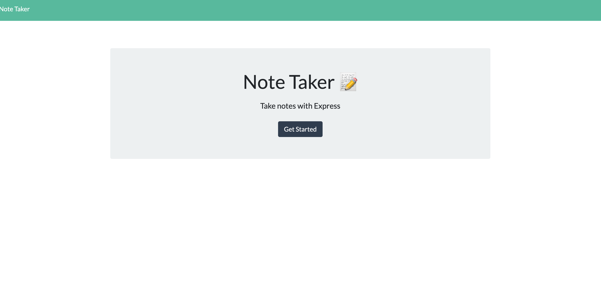
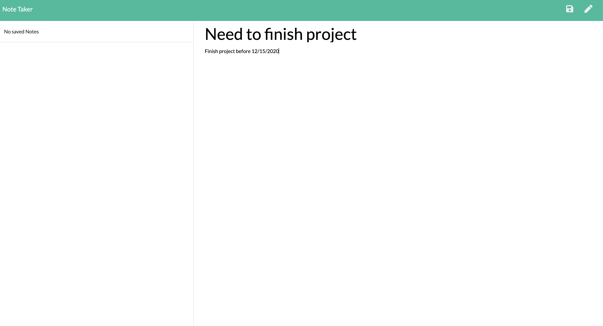
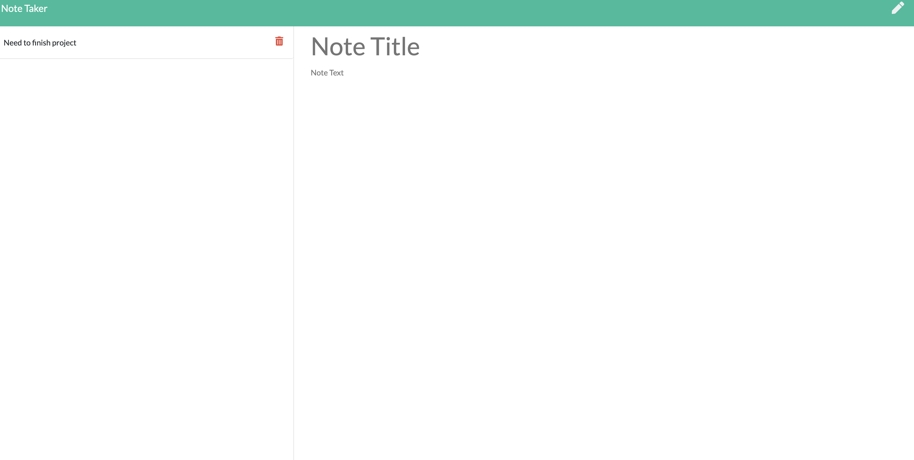

  # Note Taker.

  ## Short Description
  ### This app let users take note on the go and able to delete them form the left section.
  ## Table of Contents:
- [Installation](#Installation)
- [Usage](#Usage)
- [Licenses](#Licenses)
- [Contributing](#Contributing)
- [Test](#Test)
- [Questions](#Questions)

## Installation
To install necessary dependencies run the following command:
  npm i
## Test:
  To run tests, run the following command:
  N/A

## Usage:
  
## Licenses
**These are the licenses needed for this project.**  

## Contributing:
  Mike Bannoura

## Questions:
Contact Me: mikebannoura@gmail.com 
GitHub Username: bannoura9 
Github profile picture: 

##### Screenshots.

  
  
